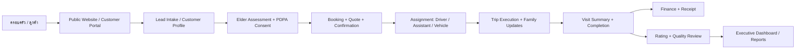
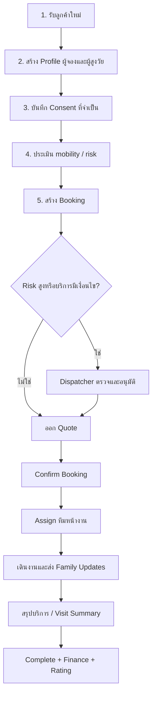

# คู่มือระบบสำหรับแอดมิน: SandyCare ERP

คู่มือนี้อธิบายคุณสมบัติ วิธีใช้งาน และลำดับงานหลักของระบบ SandyCare ERP สำหรับทีมแอดมิน, dispatcher, coordinator, finance และผู้บริหาร

## ระบบนี้ทำอะไร

SandyCare ERP ใช้บริหารบริการดูแลและรับส่งผู้สูงวัยแบบนัดหมายล่วงหน้า ครอบคลุมตั้งแต่รับ lead, ลงทะเบียนลูกค้า, ประเมินผู้สูงวัย, ขอ consent, สร้าง booking, ออก quote, จัดทีมหน้างาน, เดินงาน, แจ้งครอบครัว, ปิดงาน, รับชำระเงิน, ขอ rating และตรวจคุณภาพบริการ

ระบบไม่ใช่บริการรถพยาบาลฉุกเฉิน และไม่ใช่ระบบวินิจฉัยโรค ข้อมูลสุขภาพถูกใช้เท่าที่จำเป็นตาม consent และ audit trail

## ภาพรวมการทำงาน

## Flow การใช้งานจริง

## เมนูหลักและหน้าที่

| เมนู | ใช้เมื่อ | ผลลัพธ์ที่ควรได้ |
|---|---|---|
| Dispatch Board | ดูงานวันนี้ สร้าง/ยืนยัน booking และจัดทีม | งานพร้อม assign หรือรู้ blocker ชัดเจน |
| Trip Execution | ทีมหน้างานเดินสถานะ pickup, onboard, dropoff, completion | Timeline ครบและครอบครัวเห็นสถานะ |
| Finance Desk | ออก invoice, บันทึก payment, แนบหลักฐาน | ยอดคงเหลือถูกต้องและออก receipt ได้ |
| Notification Center | ตรวจข้อความ LINE/in-app และ retry ข้อความ | ทุกฝ่ายได้รับข้อมูลจาก source เดียว |
| Customer Portal | ให้ลูกค้าจอง ดู live journey, payment, rating, care summary | ครอบครัวติดตามงานได้เอง |
| Lead Intake | รับ lead ใหม่และประเมินเคสก่อน booking | Lead ถูก qualify และส่งต่อได้ |
| Customer Profile | เก็บข้อมูลผู้จอง/ผู้สูงวัย/mobility/ข้อควรระวัง | ข้อมูลพร้อมใช้ซ้ำในงานถัดไป |
| Incident Desk | บันทึกและติดตามเหตุผิดปกติ | งานเสี่ยงถูก hold/escalate ตาม SOP |
| Driver Screening | ตรวจคุณสมบัติคนขับก่อนใช้งาน | คนขับผ่านเกณฑ์ก่อน training |
| Training | ติดตามหลักสูตรบังคับ | ทีมพร้อมรับงานจริง |
| Quality Control | ดู rating, incident, review คนขับ | รู้ว่าควรเตือน พักงาน หรือพัฒนาใคร |
| Executive Dashboard | ดูภาพรวมสถานะ/alert | ผู้บริหารเห็นความเสี่ยงทันที |
| Reports | วิเคราะห์รายได้ งานสำเร็จ incident และ performance | ใช้ตัดสินใจเชิงธุรกิจ |
| AI Ops Center | ตรวจ AI task, verification, realtime event | งานเสี่ยงไม่ถูกส่งอัตโนมัติโดยไม่ตรวจ |
| PDPA Consent | ตรวจ consent รายผู้สูงวัย | ใช้ข้อมูลตามสิทธิ์ที่ได้รับ |
| Privacy Guard | ดู audit การเปิดข้อมูลอ่อนไหว | ตรวจย้อนหลังได้ |
| Security | ตรวจ session, readiness และ security | พร้อมใช้งาน production |
| User Admin | สร้างผู้ใช้และจัดการ PIN | ทีมเข้าใช้งานตามสิทธิ์ |
| คู่มือระบบ | อ่านภาพรวมและวิธีใช้ระบบ | แอดมินเข้าใจ flow ทั้งระบบ |

## Checklist ประจำวันสำหรับแอดมิน

### ก่อนเริ่มงาน

- เปิด Executive Dashboard เพื่อดูงานเสี่ยงและ alert
- ตรวจ Dispatch Board ว่างานวันนี้มี quote/confirmation ครบ
- ตรวจ consent สำหรับงาน assisted/hospital/home/monitoring
- ตรวจว่าคนขับ ผู้ช่วยดูแล และรถพร้อมใช้งาน

### ระหว่างงาน

- ติดตาม Trip Execution และ Notification Center
- ตรวจ family update สำหรับงาน hospital/home/monitoring
- ถ้ามี incident ระดับ high/critical ให้หยุดปิดงานและ escalate
- ใช้ AI Ops Center เฉพาะงานที่ต้อง verify identity, consent, route หรือ medical warning

### หลังจบงาน

- ตรวจ visit summary ต้องเป็น factual/non-diagnostic
- กด complete เมื่อ workflow, summary และ family notification ครบ
- ออก invoice/receipt และแนบหลักฐานชำระเงิน
- ตรวจ rating ต่ำใน Quality Control และเปิด service recovery

## กฎสำคัญ

- ห้ามยืนยันงานที่ต้องใช้ข้อมูลสุขภาพโดยไม่มี sensitive health consent
- ห้ามปิดงาน hospital/home/coordination/monitoring ถ้าไม่มี approved visit summary
- ห้ามเขียนสรุปเชิงวินิจฉัยโรคใน family summary
- ห้ามลบ audit log
- งาน high/critical incident ต้องถูก review ก่อนปิดงาน
